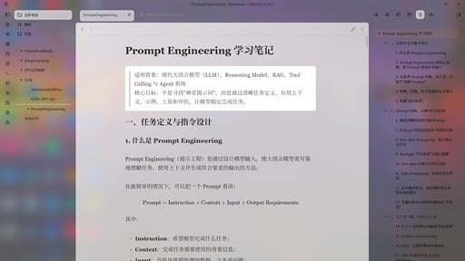
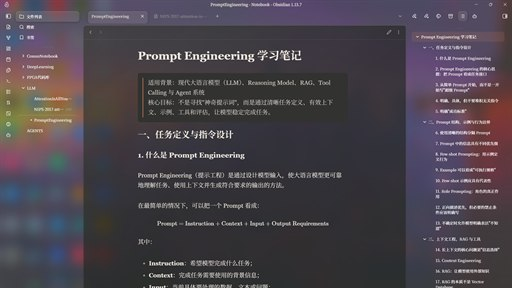

# AbsolutelyGlass

[English](./README.md) | **中文**

一个暖色调、带磨砂玻璃面板的 Obsidian 主题。笔记落在柔和的半透明表面上，而不是一整块平铺的颜色。

| 浅色 | 深色 |
| :---: | :---: |
|  |  |

*点击任一张可查看原尺寸。*

## 安装

**在 Obsidian 里装**——设置 → 外观 → 主题 → 管理，搜索 **AbsolutelyGlass**，点「安装并使用」。

**手动装**——从[最新 release](https://github.com/dingye0604/AbsolutelyGlass/releases/latest) 下载 `manifest.json` 和 `theme.css`，放进 `<你的库>/.obsidian/themes/AbsolutelyGlass/`，然后重启 Obsidian。

## 让桌面透出来（Windows 11）

默认情况下，面板模糊的是主题自己的背景，透出来的是颜色，不是你的壁纸。看上去依然是磨砂质感，只是背后不是桌面。

想把真实桌面放到窗口背后，装配套插件：

**[AbsolutelyGlass Acrylic](https://github.com/dingye0604/absolutely-glass-acrylic)**——需要 Windows 11 22H2 或更高，仅桌面端。

插件是可选的。只想要柔和一点的观感，主题本身就够了。不要与其他 Mica 或 Acrylic 窗口插件同时用——它们会争抢同一个窗口设置。

先说清楚预期：这是 Windows 自带的 Acrylic 材质，和开始菜单背后那个是同一种。它**不是** Apple 的 Liquid Glass，不会有折射或流动效果。

## 调节玻璃

安装 [Style Settings](https://github.com/mgmeyers/obsidian-style-settings) 后，打开 **AbsolutelyGlass · 玻璃材质**：

| 选项 | 默认值 | 什么时候调它 |
|---|---|---|
| 面板不透明度 | 0.64 | 桌面太花、文字看不清时调高 |
| 窗口底色 | 0.12 | 玻璃背后的颜色 |
| 模糊半径 | 24 px | 滚动发卡时调低 |
| 圆角 | 16 px | 面板圆角 |

深浅色分别调校。还有 **高可读性 · 不透明模式**，完全关闭透明——用电池时，或者只想要布局不想要玻璃时，很实用。

Style Settings 面板里的其他选项来自基础主题，照常可用。

## 系统要求

- **Obsidian 1.13.4** 或更高。
- 插件额外需要 **Windows 11 22H2（build 22621+）**，以及较新的 Obsidian 安装程序。macOS、Linux 和移动端同样能得到主题自带的磨砂面板，插件在那些平台上不会启动。

是否启用 Acrylic 由 Windows 决定。窗口一直是实色的话，检查 **设置 → 辅助功能 → 视觉效果 → 透明效果**。节能模式、远程桌面、部分显卡驱动也会让它失效，主题无法覆盖这些策略。

## 遇到问题

**桌面透不出来。** 插件没在运行。确认它已启用，且系统是 Windows 11 22H2 或更高。也可以在命令面板运行 **AbsolutelyGlass Acrylic: Reapply Acrylic backdrop** 重试。

**换了主题但 Obsidian 外观没变。** 保存笔记，彻底重启 Obsidian——重载 CSS 不会替换已经加载进内存的插件代码。

**壁纸太花，文字看不清。** 调高面板不透明度，或开启不透明模式。

**怎么换回去？** 选任意其他主题即可。插件会察觉并恢复你的窗口；停用插件效果相同。

## 致谢

AbsolutelyGlass 建立在别人的工作之上，你看到的大部分都不是我们的。

- **[AbsolutelyBaseline](https://github.com/dingye0604/AbsolutelyBaseline)**——本主题所扩展的基础，配色与排版原样继承。
- **[Baseline](https://github.com/aaaaalexis/obsidian-baseline)**，作者 [aaaaalexis](https://github.com/aaaaalexis)，MIT 许可。你看到的全部布局、组件与动画。如果你喜欢这个主题的**行为**，那是 Baseline 的功劳。
- **Instrument Serif**——Copyright 2022 The Instrument Serif Project Authors，设计者 Rodrigo Fuenzalida 与 Jordan Egstad。SIL Open Font License 1.1，内嵌于 `theme.css`。
- **Inter**——作者 Rasmus Andersson，SIL Open Font License 1.1。仅按名称引用，随 Obsidian 分发。

配色与排版方向受 **Claude** 启发。

AbsolutelyGlass 是独立的社区主题，**与 Anthropic 无隶属、赞助或背书关系**。「Claude」是 Anthropic PBC 的商标，此处仅用于描述本主题所借鉴的视觉风格。

## 许可

[MIT](./LICENSE) © 2026 dingye0604，包含 AbsolutelyBaseline 与 Baseline © 2025 aaaa​alexis。内嵌与引用的字体另有 SIL Open Font License 1.1 授权。

---

想从源码构建，或想知道到底验证了哪些、没验证哪些？见 [DEVELOPMENT.md](./DEVELOPMENT.md) 与 [VALIDATION.zh-CN.md](./VALIDATION.zh-CN.md)。
